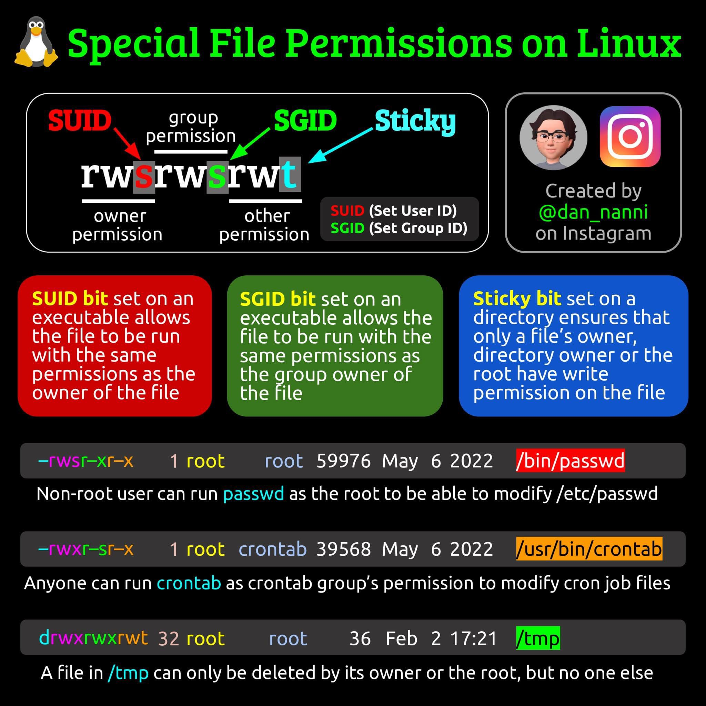

- `SUID bit` được bật trên 1 tập tin có thể thực thi - cho phép tập tin này có thể được thực thi với cùng các quyền của người sở hữu tập tin.
  Ví dụ trên, một user không phải là root (non-root user) có thể thực thi `/bin/passwd` để thay đổi tập tin `/etc/passwd` tương tự user `root`.

- `SGID bit` được bật trên 1 tập tin có thể thực thi - cho phép tập tin này có thể được thực thi với cùng các quyền của nhóm sở hữu tập tin.
  `SGID bit` được bật trên 1 thư mục thì tất cả các tập tin tạo trong thư mục này thuộc nhóm sở hữu của thư mục.

  Ví dụ trên, bất cứ user nào thuộc nhóm `crontab` đều có thể thay đổi tập tin cron job.

- `Sticky bit` được bật trên 1 thư mục đảm bảo chỉ có người sở hữu, nhóm sở hữu hoặc `root` là có quyền ghi/ xóa các tập tin bên trong thư mục. 
  `Sticky bit` không có hiệu lực trên tập tin.
  Ví dụ trên, một tập tin trong /tmp chỉ có thể được xóa bởi người sở hữu hoặc `root`, cấm ghi đối với tất cả các user khác.

# `chmod` Cheatsheet

| Syntax                          | Example             | Description                                                  |
| ------------------------------- | ------------------- | ------------------------------------------------------------ |
| `chmod [u/g/o/a][+/-/=][r/w/x]` | chmod u+rg-wxo=rx+x | [u/g/o/a]: u - user, g - group, o - other, a - all<br />+ : add, - : remove, = : set<br />r - read, w - write, x - execute |
|                                 | chmod +x            | a can be obmitted                                            |
| `chmod 777`                     |                     |                                                              |
| `chmod -R`                      |                     | Set permission(s) recursive                                  |

## Octal Digit vs. Sympolic

| Octal Digit | Permission(s) Grant                           | Sympolic    |
| ----------- | --------------------------------------------- | ----------- |
| 0           | None                                          | [u/g/o]-rwx |
| 1           | Execute permission only                       | [u/g/o]=x   |
| 2           | Write permission only                         | [u/g/o]=w   |
| 3           | Write and execute permissions only: 2 + 1 = 3 | [u/g/o]=wx  |
| 4           | Read permission only                          | [u/g/o]=r   |
| 5           | Read and execute permissions only: 4 + 1 = 5  | [u/g/o]=rx  |
| 6           | Read and write permissions only: 4 + 2 = 6    | [u/g/o]=rw  |
| 7           | All permissions: 4 + 2 + 1 = 7                | [u/g/o]=rwx |

## Common `chmod`:

| Description                                                  | Command                                |
| ------------------------------------------------------------ | -------------------------------------- |
| Change all file and directory permissions `rwxr-xr-x` recursive | `chmod -R 755 .`                       |
| Change directory permissions to `rwxr-xr-x` for each sub directory in current directory (exclude files) | `find . -type d -exec chmod 755 {} \;` |
| Change file permissions to `rw-r--r--` for each file in current directory (exclude directories) | `find . -type f -exec chmod 644 {} \;` |

## Special Permissions

| Special Permissions | Command                             | Command                            |
| ------------------- | ----------------------------------- | ---------------------------------- |
| SUID bit = 4        | `chmod 4770 /opt/scripts/backup.sh` | `chmod u+s /opt/scripts/backup.sh` |
| SGID bit = 2        | `chmod 2770 /opt/scripts`           | `chmod g+s /opt/scripts`           |
| Sticky bit = 1      | `chmod 1775 /appvol/logs`           | `chmod o+t /appvol/logs`           |

# Default Permissions

Find your default user and group permissions when you create a new file or directory

```sh
umask
```

Get a four-digit number which:

- if subtracted from 0777, gives your default permissions for creating a directory.
- if subtracted from 0666, gives your default permissions for creating a file.