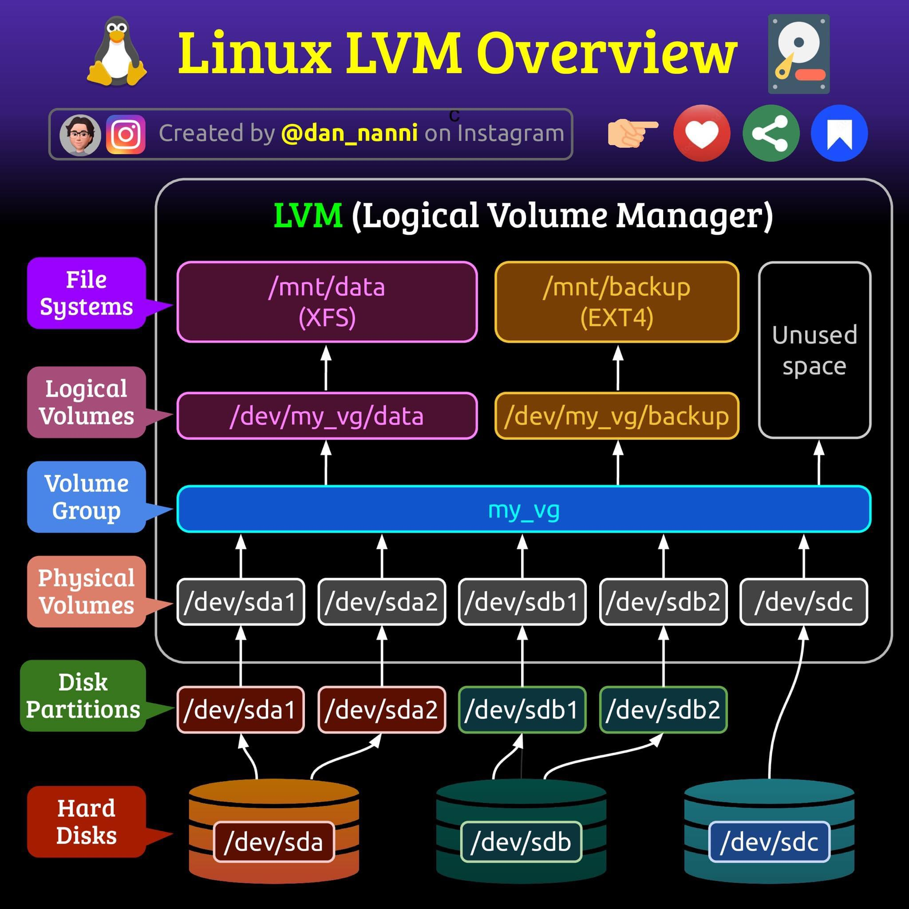

# Linux LVM Overview



# Cheat sheets

## Resize disk

- Refer: https://www.tecmint.com/extend-and-reduce-lvms-in-linux/

### Get info for Resize logical volume

| Description                    | Command |
| ------------------------------ | ------- |
| Get info of Physical Volume(s) | pvs     |
| Get info of Volume Group       | vgs     |
| Get info of Logical Volume(s)  | lvs     |

### Extend partition

```sh
sudo fdisk /dev/sda
```

| Step by step:                                                |
| ------------------------------------------------------------ |
| Enter `p` to print your initial partition table.             |
| Enter `d` (delete) followed by 2 to delete the existing partition definition (partition 1 is usually /boot and partition 2 is usually the root partition). |
| Enter `n` (new) followed by `p`     (primary) followed by `2` to re-create partition number 2 and `enter` to accept the start block and enter again to accept the end block which is defaulted to the end of the disk. |
| Enter `t` (type) then `2` then `8e` to change the new partition type to "Linux LVM". |
| Enter `p` to print your new partition table and make sure the start block matches what was in the initial partition table printed above. |
| Enter `w` to write the partition table to disk. You will see an error about device or resource busy which you can ignore. |

```sh
sudo reboot now
```

### Update kernel in-memory partition table

```sh
partx -u /dev/sda
```

### Resize Physical Volume

```sh
pvresize /dev/sda2
```

### Extend Logical Volume

| Description                    | Command                                | Output                                                       |
| ------------------------------ | -------------------------------------- | ------------------------------------------------------------ |
| Get free block of Volume Group | vgdisplay                              | Free PE / Size    `4352` / 17.00 GiB                         |
| Get logical volume name        | lvdisplay                              | --- Logical volume ---<br />LV Path        `/dev/centos/root`<br />LV Name        root<br />VG Name        centos |
| Extend logical volume          | lvextend -l `+4352` `/dev/centos/root` |                                                              |
| Re-size the file system        | xfs_growfs `/dev/centos/root`          |                                                              |

### Check result

```sh
df -kh
```

